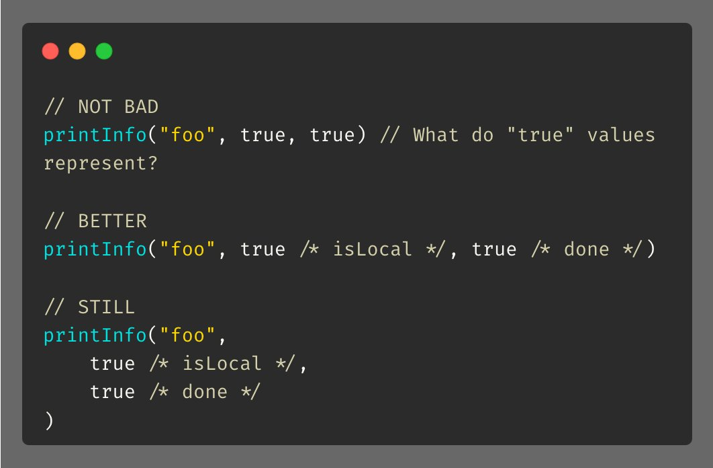

@010_Go语言编程技巧.md (1-6)

# Go语言编程技巧

来源: https://colobu.com/gotips/010.html

---

# Tip #10 避免裸露参数
原始链接：Golang Tip #10: Avoid Naked Parameters这是一个简单易行的技巧，可以提高函数的可读性，特别是在你的集成开发环境（IDE）不支持内联提示的情况下。我们可以通过使用结构体来实现这一目标，需要注意的是，结构体中的字段将是可选的而非必填项。你对此有何看法？

