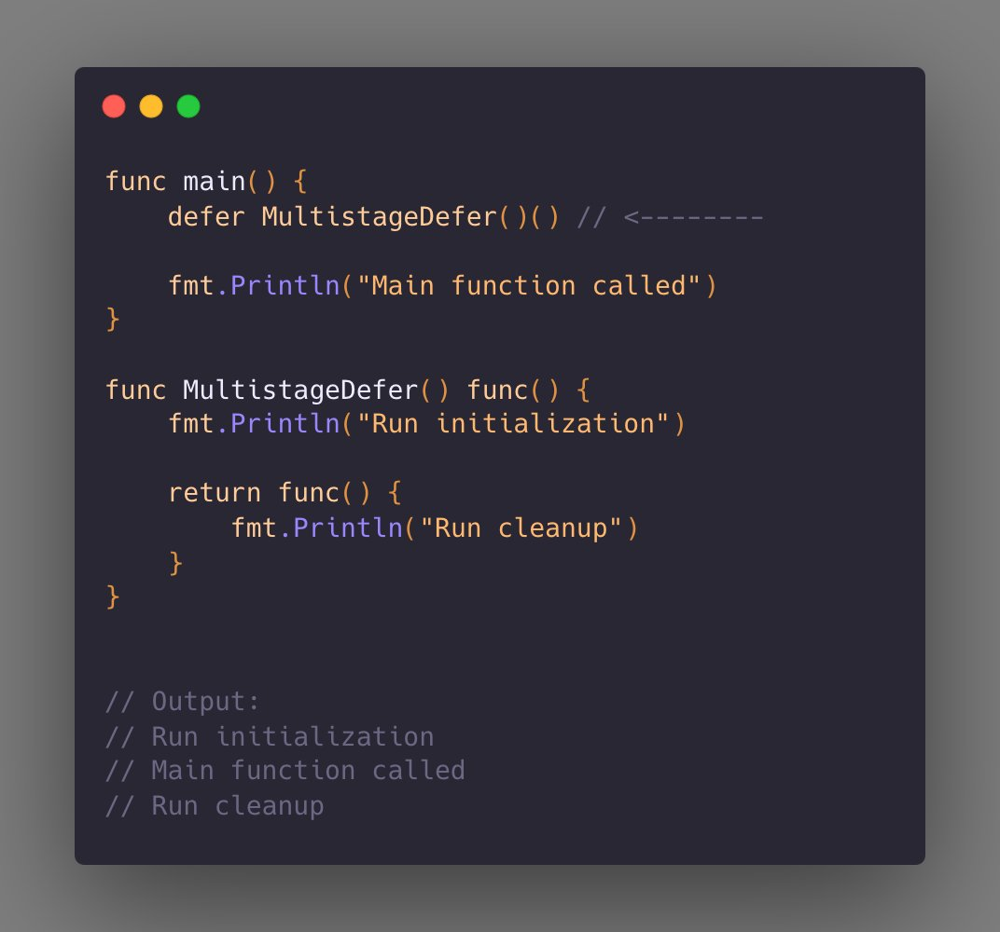

@002_Go语言编程技巧.md (1-6)

---

# Tip #2 多阶段 defer
实现在另一个函数的开头和结尾处执行一个函数。下面的图片展示了这一实现方式。



# defer的作用与底层原理

```
golang defer 关键词
作用：延迟调用
特点：延迟调用，多个defer函数的调用顺序为后进先出
注意事项:无意识构建了闭包函数
常见应用场景：资源释放、异常的捕获和处理
```

```go
package main

import (
	"fmt"
	"os"
)

func main() {
	f1()
}

func f1() {
	// 资源的释放
	file, _ := os.Open("main.go")
	defer func() {
		file.Close()
		fmt.Println("关闭文件")
	}()

	// 异常处理
	defer func() {
		if err := recover(); err != nil {
			fmt.Println("异常处理：", err)
		}
	}()

	i := 1
	defer func() {
		fmt.Println("数字：i =", i)
	}()
	defer func(j int) {
		fmt.Println("数字：j =", j)
	}(i + 1)

	i = 99
	fmt.Println("正常流程打印")
	panic("panic 异常")
	fmt.Println("异常后流程打印") // 不会执行
}
```

```
正常流程打印
数字：j = 2
数字：i = 99
异常处理： panic 异常
关闭文件
```

- `defer` 的执行顺序是**后进先出（LIFO）**。
- `panic` 后的代码不会执行（如 `"异常后流程打印"` 不会打印）。
- `recover()` 必须在 `defer` 中调用，才能捕获 panic。
- 匿名函数传参是**值传递**，所以 `j` 的值是 `i+1` 当时的值（即 `2`），不受后续 `i = 99` 的影响。
